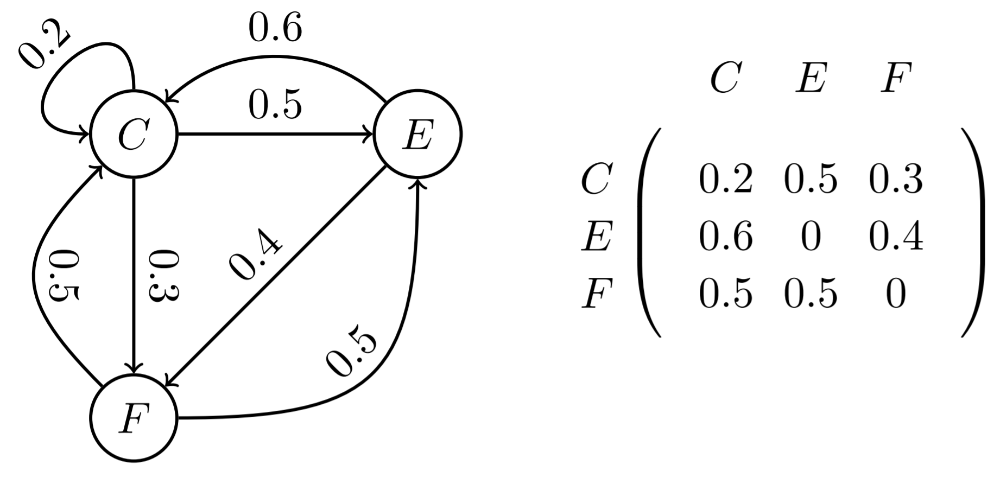
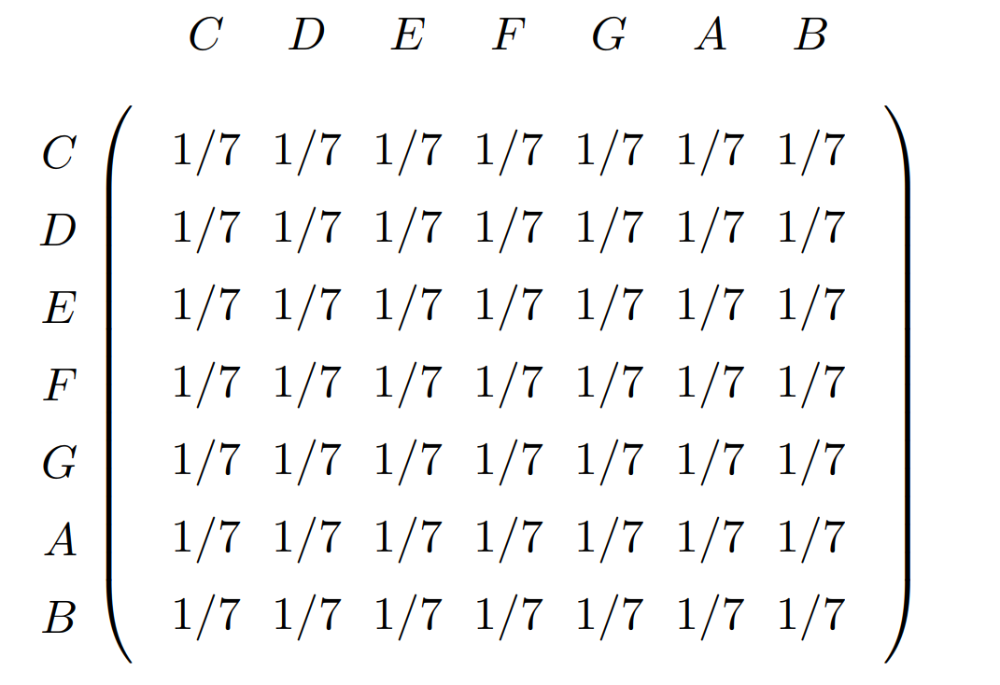
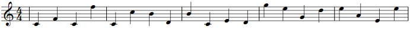
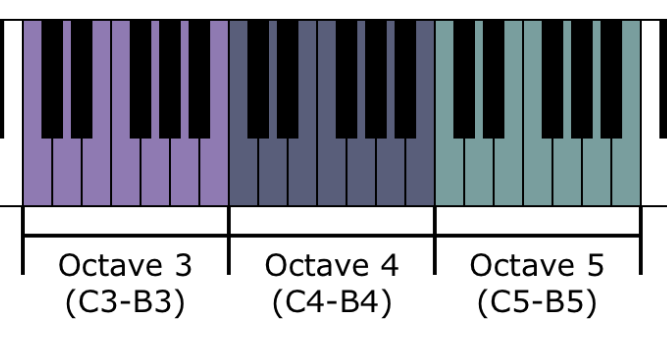
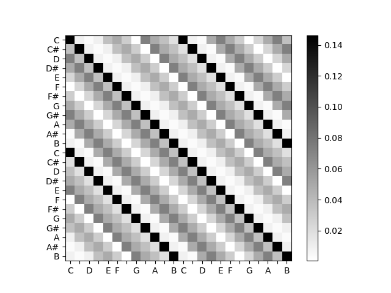
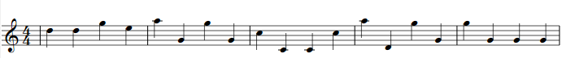
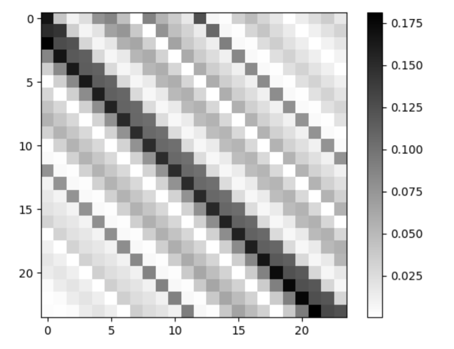
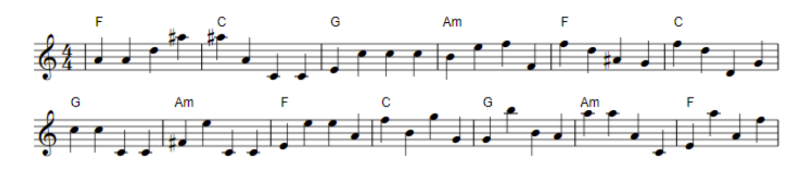

# Music generation with Markov Chains

> This post is under development and is subject to changes 

Algorithmic generated music is not a new thing. Johann Philipp Kirnberger proposed a music generating dice game in 1757 and many similar ways to auto generate music followed [1]. The common denominator for many of these early algorithms was randomness. It seemed like you could generate ok-sounding music with randomness and some knowledge of music theory. Today, algorithms for generating music are carried out on computers, and we have moved on from randomness as the core of the algorithm. But when computers were new, your best bet was still to use the old strategy of introducing randomness in an environment built with music theory. Most of these early-computer-era algorithms relied on Markov Chains, which is what we will explore here.

A couple months ago I got obsessed with the theory of computer generated music. Shortly after, I could not believe my eyes when I read “generate music with Markov chains” as one of the possible projects for a university course. This blog post is a summary of that work [2]. I hope the reading is as inspiring as doing the project was!

## Markov chains
A markov chain is a set of stochastic variables (SV) distributed over discrete time points where one SV is only dependent on the previous SV. In other words, the state at timestep t can only depend on t-1 and not further back in history. A markov chain can be defined as a directed graph with values in the nodes and a probability at each edge. An example is given below. When at state E, the probability of going to F is 40% and 60% for C, note that this does not depend on previous states. This graph can be represented with a square matrix, where element a_ij describes the probability of moving from i to j.

## Generating music
If we assign a note to each node in such a graph, jumping around in the graph will create a melody. To keep things simple, we initially choose the notes to be in the C major scale (white keys on a piano) and all probabilities to be the same. The matrix representation of this markov chain:

To generate the music this matrix was implemented in python, and in each iteration of a loop, the next note was picked with numpy’s random number generator. The result is as expected, equivalent to randomly hitting white keys on a piano with constant rhythm.

`audio: https://www.maths.lth.se/matematiklth/personal/tomasp/MarkovSong1.mp3`

# Use music theory to improve results
To improve the results we will use observations from music theory to change the matrix. The first observation is that certain notes sound good together. If note i and j sound good together, it makes sense to increase the matrix element a_ij, the probability of going from i to j. But which notes sound good together? When a note is played, a sound wave of a certain frequency propagates from the speaker, this is the fundamental harmonic. For example, this frequency is 440 Hz for the middle C on the keyboard. But other harmonics of higher frequencies are also produced, these are integer multiples of the fundamental harmonic. It has been observed that notes which share many harmonics sound good together. Mathematically, sharing harmonics is equivalent to having frequencies which have a ration of a rational number. The most common chords, triads, are made from notes with ratios 1:3/2:5/4. In the special case where the ratio is an integer, the notes sound so good together that we say that they are the same note but played in different octaves.

[4]

On a piano, there are 12 notes in an octave, and the frequency ratio to the corresponding note in the next octave is 2. Therefore the frequency ratio between the first and the k:th note is 2^(k/12). Unfortunately the only rational number in this sequence is when k is a multiple of 12. Does this mean that there are no notes within an octave that sound good together? Luckily, our ear is not perfect, and ratios that are very close to a rational number does also sound good together. I previously mentioned the ratios 1:3/2:5/4, in reality, these do not exist, but some notes come very close. We now have a new objective: instead of increasing the matrix elements which correspond to rational ratios, increase the matrix elements which correspond to good approximations of rational ratios. The algorithm used to do these approximations can be found in [2]. The algorithm yields the following matrix:

With this matrix we can generate our second melody. Note that we still only chose to play in the C major scale even if the matrix now includes all notes.

`audio: https://www.maths.lth.se/matematiklth/personal/tomasp/MarkovSong2.mp3`

## Still shitt
You could argue that this melody is better than the first, but it is still pretty bad. Another observation from music theory is that notes far from each other are rarely played subsequently. Jumping back and forth between very high and very low notes creates an unwanted chaotic feeling. Therefore we want to decrease the matrix elements that are far from the diagonal. To do this, each matrix element a_ij was divided by the distance between i and j (plus a constant c to avoid division by zero and make results smoother, see [2] for details). The updated matrix:

## Adding chords
To make things more interesting we can add chords. Picking a good chord progression (sequence of chords) can either be done with complex music theory, or by picking (C, G, Am, F) which is famous for being used in extremely many pop songs [3]. Here we will hold tight to our dream of becoming pop stars and choose the latter strategy. When generating music with chords, we don't want to stick to our C major scale, instead we want to pick chords from the scale of the chord that we are playing. Note that we now include black keys on the piano (note with #), as these are included in the F and G major scales.

`audio: https://www.maths.lth.se/matematiklth/personal/tomasp/MarkovSong3.mp3`

## Going further
The result is still bad. Implementing a non-constant rhythm would be a good next step. Music theory offers endless ways to tweak the matrix, but it seems like each improvement is slim and cumbersome to implement. Another approach would be to learn the matrix from data. A naive approach would be to take a set of songs and count how many times one note appears after the other. The matrix element would come from normalization of these counts [1]. This is called a n-gram model in Natural Language Processing. Unfortunately, this approach doesn't produce hit songs either. The markov assumption made in the beginning, that one state can only depend on the previous state, is what is holding us back. To go further we have to use more advanced algorithms than markov chains. This is what I intend to explore on this blog, I hope you would explore it with me!

### Sources
[1] https://drive.google.com/drive/folders/1SfXf3pqShZDHdUlr2YTKnjDXdYlwdb4g

[2] [Our project](./Matkomm_AutoMusik_Projekt.pdf)

[3] https://www.youtube.com/watch?v=oOlDewpCfZQ

[4] https://music.stackexchange.com/questions/69410/what-is-an-octave

