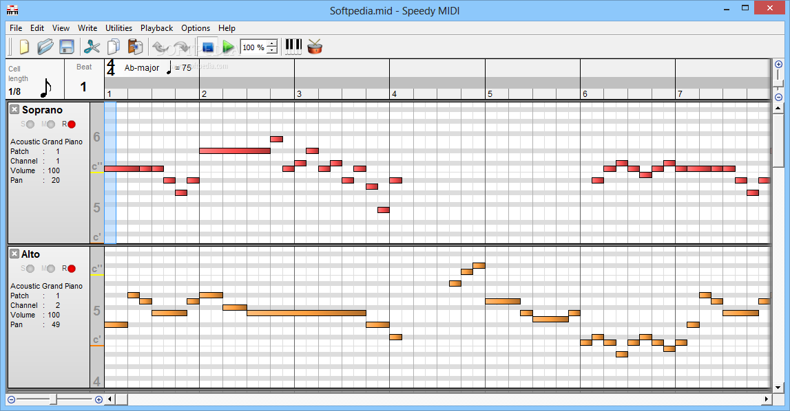
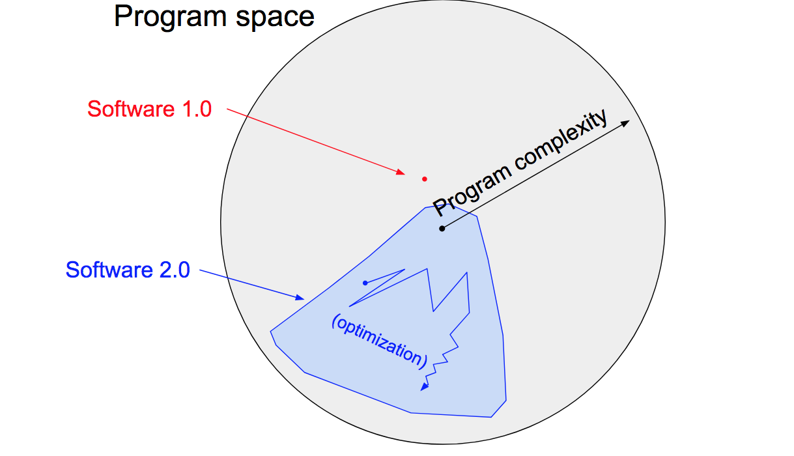

> This post is under development and is subject to changes 

In this post I want to dream into the future. To a time when we have models creating decent melodies, which is hopefully not too many blog posts away! Here I want to explore how the outlines of these models will look. What will be the format of the input and output?

There are two main ways to represent music digitally. Raw audio files, and some form of symbolic representation. Before the computer era, we did not have the choice to store raw audio files, and all music was stored as symbols. It took humanity many iterations before settling on the staff notation as the most popular throughout the world [1]. In music production today is MIDI a popular format to represent a song symbolically. In a MIDI file, each instrument is represented by a  “track” and it holds information about the notes and their timings played by that instrument. A simple midi file can be visualized below.

[6]

So, which format, midi or raw audio, should we use when we start building our models?

## Size
A raw audio file contains all the information of the song and is therefore much bigger. Storing just the symbolic representation, as midi does, can be seen as a compression where we want to keep as much information with the least amount of storage as possible. However, this compression is not lossless. The downside of storing all information is that the computation will be much slower. For example, OpenAI’s Jukebox model was trained on raw audio and using it to generate a single song will take hours [5].

## Availability
There is no shortage of audio files on the internet, you will never have the problem of not finding an audiofile of the song you have in mind. This is not the case with MIDI. There are some databases online with MIDI files freely available [2], but I find quite often that the song I am interested in is not available. There have been attempts to build systems which generate a MIDI file from raw audio, however the resulting midi is rarely of desired quality. Building such systems could be a topic for a future blog post.

## Workflow
Working with MIDI files is not trivial. There do exist libraries for most popular programming languages, but in my experience, working with MIDI can still be frustrating. Building tools to ease this process will be a topic of a future blog post. But if MIDI is hard to work with, raw audio can be considered impossible (depending on the task). Imagine trying to analyze the music theory property of an audiofile. MIDI on the other hand, is based on the staff notation which humans have optimized for ease of use over thousands of years.

## Output space
The most important aspect in choosing the format is the output that it can produce. If MIDI is chosen, we will guarantee that the output song will consist of notes. A raw audio output might just produce noise that has no resemblance to music. Another advantage to MIDI is that its output is human interpretable. MIDI can be transformed to staff notation and then be performed by humans and analyzed from a music theory perspective. In future blog posts we will try to analyze if our models have learned music theory concepts (and perhaps discovered new ones). But MIDI is also limited. As discussed previously, MIDI is a lossy compression and the theoretically best possible output might be dependent on information that was removed. In the following sections, I will present 2 different ways of getting an intuition for this.

### Restricted optimization space
In his brilliant medium post [3], Karpathy describes how software 2.0 (machine learning) is fundamentally different from software 1.0 (traditional programming). In 1.0, the programmer gives the computer instructions on how to execute a task. In 2.0, the programmer provides a space of possible instructions, and the computer has to figure out which instructions to pick to optimize some objective.

In our case of music, these instructions would be which notes to play or what wavelengths to produce. A software 1.0 approach would be to simply write down the staff notation or record the wavelengths of a song we create. If we want the computer to create the song, we need to use software 2.0. Using MIDI will give a more restrictive set of instructions (only the notes found in staff notation) to choose from. Hence, the blue area in the image will be smaller.

Using raw audio files gives a huge set of possible instructions (the computer can choose any soundwave). The optimal solution might be outside the reach of the model trained on MIDI. On the other hand, the optimal solution might be too hard to find for our optimization algorithm. It might be easier to find a good suboptimal local minima with the smaller set of instructions.

### Feature engineering
Machine learning is often said to be just compression, the question is: What is the best way to compress data so that it can be used to make decisions. Humans have agreed that the staff notation is a good strategy, but what is best for the human might not be best for the computer.

In deep learning, the task of the hidden layers is to find a good representation of the data (compression) which the last layer can base its actions on. With this in mind, limiting the information given to the computer might prevent it from finding the representation that works best for it.

Extracting out the notes, timings and instruments as the dimensions that define the song is feature engineering. We extract these things because as a human these are the information that matters to us when we define the song. But computers might prefer to represent the song differently. This representation might not be interpretable for humans.

 A similar example can be found in the self driving industry. One approach is to define a list of all things that matter for driving (ex: other cars, signs, lane lines, etc) and then use object detection to get a representation of the current scene. The car can then take actions based on this representation of the scene (feature engineering). Another approach would be to just feed images to the car and let it figure out itself what part of the image is relevant to represent the scene (end-to-end)[4].

## Conclusion
The self driving industry started off doing feature engineering, because end-to-end was considered too hard. But recently, some companies realized that the best possible long term strategy is end-to-end. I think computer generated music will go through the same phases. Working with midi is easier and computationally less expensive, so initially, most models explored on this blog will use midi as input and output. However, as the field of computer generated music evolves I think more and more models will use raw audio files.

### Sources
[1] https://en.wikipedia.org/wiki/Musical_notation#Ancient_Near_East

[2] https://bitmidi.com/

[3] https://karpathy.medium.com/software-2-0-a64152b37c35

[4] https://blog.comma.ai/towards-a-superhuman-driving-agent/

[5] https://www.youtube.com/watch?v=N1G_mSAaoUs&t=66s

[6] https://www.softpedia.com/get/Multimedia/Audio/Audio-Editors-Recorders/Speedy-MIDI.shtml#sgal_0

