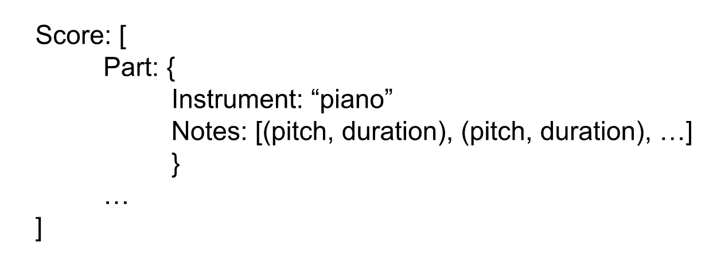
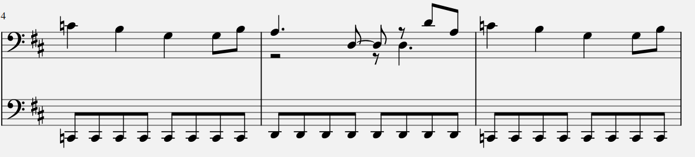
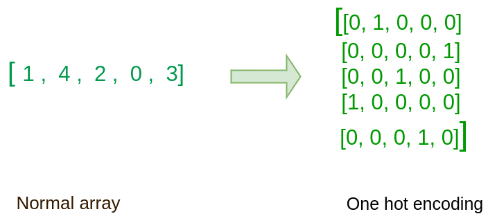
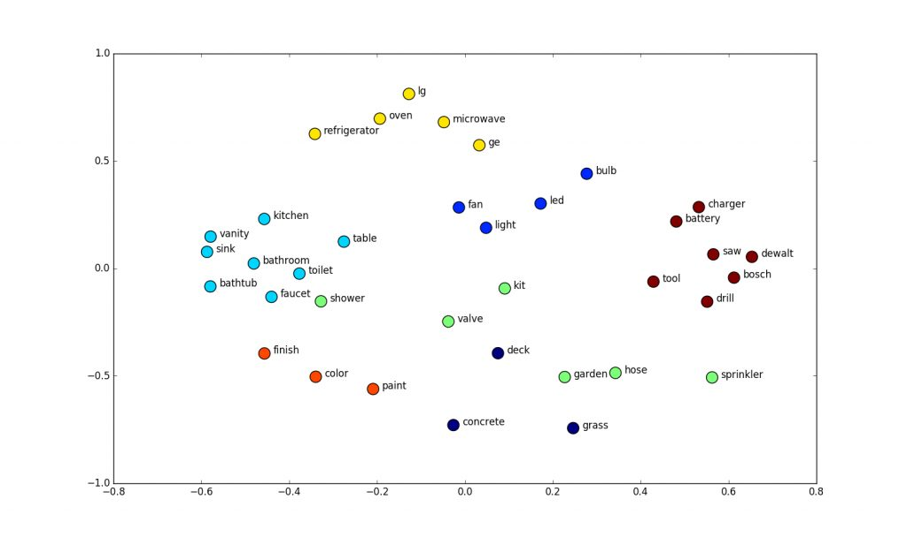
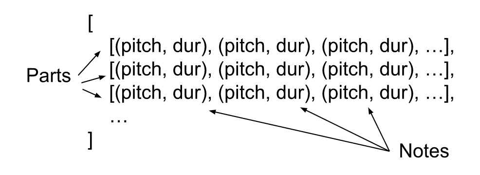

> This post is under development and is subject to changes 

Our [first attempt to generate music](https://yetools.net/1_markov_chains/markov_chains/) did not prove to be successful. Our suspicion was that the degrees of freedom were too vast, and a [software 1.0 solution](https://karpathy.medium.com/software-2-0-a64152b37c35) was not sufficient. We already knew that this was going to be the case, but you have to walk before you run. Today we take the next step on our journey and explore music generation with simple Machine learning models, and then we continue towards state of the art models.

Before we can start training the models, we have to prepare the data. Here we choose to represent the music symbolically rather than with raw audio. The reasons for this were discussed in the [previous post](https://yetools.net/2_music_representation/music_repr/). We’ll use the [Lakh dataset](https://colinraffel.com/projects/lmd/), which consists of ~180k MIDI files, and the python library [Music21](https://web.mit.edu/music21/doc/index.html) for processing.

A single MIDI file can easily be read with music21’s `converter.parse()` function. This returns a `Score` object which consists of one `Part` object per instrument played in the song. Each part contains the notes played by that instrument. Each note has info about the pitch (represented by a number 0-128), duration (here we represent this by a number 1-16, where 1 is a 16th note and 16 is a whole note). A part can also contain rests and chords, but these will be disregarded for simplicity. However, these obviously hold important information and will be included when we improve the dataset in a future post.



A simplified representation of a song represented in music21.

## Limiting scope
As explained in the [previous post](https://yetools.net/2_music_representation/music_repr/), the optimization process during training is easier with a limited output scope. It is therefore beneficial if we can limit the set of notes we have in our training data. 

Most pieces of music have a constant key, which means that all pitches come from the same scale. The scales C major and A minor only contain the pitches which are played with the white keys on the piano. Therefore we can limit the scope of possible pitches by only includeing songs which played in these keys in the traing data. Music21 provides tools for retrieving the key and transposing the song to another key.

```
k = score.analyze('key')
p = "C" if k.mode == "major" else "A"
i = m21.interval.Interval(k.tonic, m21.pitch.Pitch(p))
score = score.transpose(i)
print("Transformed from key:", k, "to:", score.analyze('key'))
```

However, this process is really slow. Transposing a single song takes more than 10s. In a future post we will implement a parallelized data processing pipeline, and then it might be feasible to do this. But for now we will skip this step and include all types of keys.

Another way to limit the output scope is to limit the note’s durations. Most songs either contain durations which are multiples of ¼ or ⅓, with ¼ being more common. We therefore aim for a dataset with only ¼ multiples as durations. We can loop through a couple of parts to see how many parts we have to throw away with this limitation.

```
tot_parts = 0
useable_parts = 0
   
acceptable_durations = set([i/4 for i in range(1, 17)])
for i, file in enumerate(glob.glob("data/lmd_full/2/**/*.mid", recursive=True)): 
    if i > 10: break
    s = m21.converter.parse(file)
    for part in s.parts:
        tot_parts += 1
        c = 0
        for note in part.notes:
            if float(note.duration.quarterLength) not in acceptable_durations:
                c += 1
        if c < 20:
            useable_parts += 1
print(useable_parts, tot_parts)

>>> 161, 193
```

If we accept all parts which have less than 20 durations which are not a ¼ multiple, 161/193 = 83% of the parts are usable. We can therefore filter out these parts without losing too much of our data. The parts which have  0<x<20 non acceptable durations can be included but with these notes filtered out.

## More filters
It is also reasonable to filter out extremely short and long durations. We also remove parts which are played by certain instruments. Drums for example have a different note notation. 

Finally, looking at the data it is apparent that certain parts are too repetitive. Most songs have some parts which provide melody, and others for rhythm. Here is an example:



Ideally we would only train the models on parts which have melody, as our goal is to generate melody. A heuristic for guessing which parts have melody is to look at the standard deviation of the note pitches of the part. Numpy provides tools for calculate this:

```
np.std([int(note.pitch.midi) for note in part.notes])
```
By printing this value for a couple of parts I came to the conclusion that it is reasonable to filter out songs with standard deviation less than 2.

## Data representation
We now have a preprocessed dataset of music pieces. The next task is to represent these music pieces in a computer readable format which is as simple as possible.

### one hot encode
A common way to represent numbers as categorical data is by one-hot-encoding. The number is represented by a sparse vector filled with zeros except for a 1 at the index of the number. The intuition behind this is to communicate to the computer that the value of the number is not important. To use this in our case, we could one-hot-encode the pitch and duration of each note and represent the note as these vectors concatenated.



One-hot-encoding [example.](https://www.geeksforgeeks.org/one-hot-encoding-using-tensorflow/)

### dur hot encode
However, the durations are not categorical data, it therefore does not make sense to one-hot-encode them. A potential solution to this is to build a sparse vector with the note’s duration at the index of the note’s pitch.

### tuples
Furthermore, one could argue that the pitch is also not categorical data. It is categorical in the sense that each key on the piano is a category, but the pitch represents the wavelength of the soundwave that it creates. This is a numeric value, and we would want our algorithm to treat it as a regression value which can be compared. With this in mind we end up representing the note in the simplest possible way: a tuple `(pitch, duration)`.

### embeddings
State of the art models in language modeling use embeddings as inputs for each word. Embeddings are high dimensional vectors which have been tuned by an algorithm to represent the word’s meaning in the context of its surrounding words. A similar solution could be implemented for notes, but we will save this for a future post.


[Example](https://www.shanelynn.ie/get-busy-with-word-embeddings-introduction/) of 2d word embeddings.

My guess is that the embeddings implementation would perform the best, but it is not clear which of the other three is best. One could try all three and compare, but I think the final system will have bigger bottlenecks. Comparing these methods could be meaningful once we have better models and all other things which I have marked as “to do in a future post” are implemented. Because neither pitch nor durations are categorical data, we will choose to go with the tuple representation.

The final step is now to use this note representation to create a dataset of all our songs. An easy way is to have a big list with all parts.




This way, we lose the information that certain parts are played together in the same song. This is essential information if we were trying to compose a musical piece of multiple parts, but here we are only trying to generate standalone melodies. Therefore we accept this solution as it is simple to implement.

## Conclusion
In this post we have imported a public dataset and modified it to fit our needs. For each song we filtered out parts according to some criterias. For the parts which we kept, we filtered out certain notes. We then represented the remaining data as a list of parts where the part’s notes were represented as a tuple of the note’s pitch and its duration. In the next post we will use this data to train a feedforward neural network. See you then!

