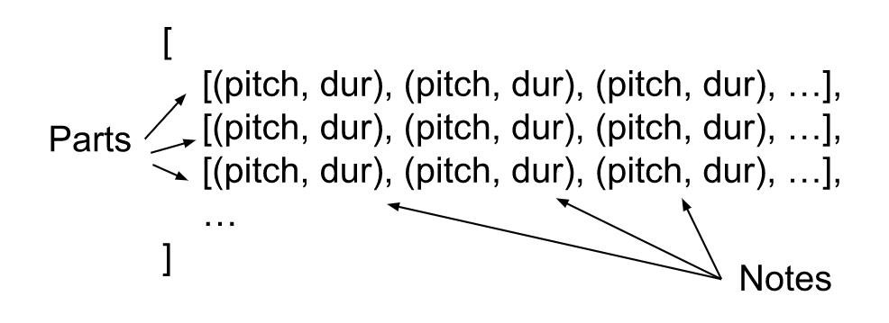

> This post is under development and is subject to changes 

A [language model in NLP](https://en.wikipedia.org/wiki/Language_model) is a model which predicts the next word based on the previous words. Such a model can be used to create text by iteratively adding the predicted word to the list of words and using the new list as the basis for the next prediction. Similarly, we here try to build a melody model, a model which predicts the next note based on previous notes. We then use it to create a melody! In this post our model will be a simple feedforward neural network (FNN). In the next post we will improve our melody generator by implementing a LSTM model.


## Input dimensions
In the [last post](LINK) we prepared a dataset as a list of parts where the notes of the parts were represented as a tuple of the note’s pitch and duration.



With this representation we get a 2d vector of size (5,2) if we want to predict the next note based on the previous 5 notes. This is a problem as FNNs only take 1d vectors as input. A simple solution would be to flatten the input vector to a (10, 1) vector with every other element being a pitch and the others durations.


However, a lot of information is lost when we stop distinguishing between pitches and durations. A complex enough model could figure out this pattern and realize that it should treat elements on even indexes in a certain way and elements on odd indexes in another. This puts a lot of demand on the network to understand this complexity. Another solution could be to treat the pitch and duration separately and have two FNNs. However, this separation might be too strong. I am not an expert in music theory but my intuition is that there is information loss by completely separating them. For example, it could be that notes with higher pitch are generally played for shorter duration.

If we want to differentiate between pitch and duration, but not handle them completely separately, we can use a mapping function F: R²->R¹. For example: multiply pitch by 100 and add it to the duration. We can use this function as the input to the FNN and then run the function backwards on the output of the FNN. 


The downside of this is that we use hardcoded compression instead of letting the computer decide how to compress the data in a way that is optimal to optimize its objective. This is often worse, as discussed in [this post](https://yetools.net/2_music_representation/music_repr/). There are many more methods to reduce 2d inputs to 1d, it is for example extensively studied in computer vision. The solution that we present here is to model the notes as complex numbers, with pitch and duration as the real and imaginary part. We then feed them to a complex valued FNN (CVNN).

```
note = pitch + i * duration
```

## CVNN
 A CVNN is a FNN but where the inputs, weights, biases, nonlinearities are complex valued. Only the loss is real valued. Here is a simple example implementation in pytorch:

```
def complex_relu(z):
    return relu(z.real) + 1.j * relu(z.imag)

class CvnnTest(nn.Module):
    def __init__(self):
        super(CvnnTest, self).__init__()
        self.l1 = nn.Linear(1, 5).to(torch.cfloat)
        self.l2 = nn.Linear(5, 5).to(torch.cfloat)
        self.l3 = nn.Linear(5, 1).to(torch.cfloat)
        self.relu = complex_relu

    def forward(self, inputs):
        x = self.l1(inputs)
        x = self.relu(x)
        x = self.l2(x)
        x = self.relu(x)
        x = self.l3(x)
        return x
```
To showcase it, we train it as a function estimator for a function which learly transforms the real and imaginary parts separately `f(z) = (2*z.real+5) + i*(3*z.imag-3)`. We generate random complex numbers as features and run them through the function to get the labels. We train the CVNN on this data on 1000 batches of 1000 points each. The loss is really low after only 400 batches. This is to be expected as the task is not so complex.


Since the loss is low, we suspect that our model has learned to mimic the function well. By plotting the model output next to the function output we can see that this is indeed the case.


 

The phase rotating nature of multiplication of complex numbers at [has been shown](https://arxiv.org/pdf/2101.12249.pdf) to be advantages during training of CVNNs compared to FNNs. [Additional benefits can be gained if the real and imaginary parts are dependent as information can be encoded in the phase. This is for example the case if one encodes images with complex numbers, the phase encodes information about shapes, edges and orientation](https://arxiv.org/pdf/2101.12249.pdf). There is no dependance in our toy example, but it might be the case with music. As I stated above, my intuition is that a note’s pitch and duration is somehow dependent. We can search for such dependance by plotting all notes in our dataset in a plotting all notes in our dataset in a 2d histogram.


No correlation between pitch and duration can be determined from this plot, but there can be dependance without correlation. this is something to investigate in the future.


## Melody generation
The implementation of the [CVNN class](https://github.com/lukaspetersson/ye_tools/blob/main/lstm/cvnn.py) in the music case is very similar to test example above. With the data we prepared in the last post, we create a [pytorch dataset](https://pytorch.org/tutorials/beginner/basics/data_tutorial.html) with features as sequences of 5 notes and labels as the following note. The training loop is a standard pytorch training loop which plots the mean loss for each epoch.

```
def train(dataset, model, num_epochs):
    model.train()
    loss_vals = []

    dataloader = DataLoader(dataset, batch_size=64)
    loss_fn = nn.L1Loss()
    opt = optim.Adam(model.parameters())
    
    for epoch in range(num_epochs):
        epoch_loss = []
        for x, y in dataloader:
            opt.zero_grad()
            y_pred = model(x)
            loss = loss_fn(y_pred, y)
            loss.backward()
            opt.step()
            epoch_loss.append(loss.item())
        loss_vals.append(sum(epoch_loss)/len(epoch_loss))
    plt.plot(np.linspace(1, num_epochs, num_epochs).astype(int), loss_vals)
    plt.title("L1 loss")
    plt.xlabel('Epoch')
    plt.ylabel('Loss')
```


We can now use our melody model to generate a sequence of notes by appending each newly generated note to the sequence and use this new sequence as the basis for the next prediction. 

We can now create a melody from a starting sequence of notes with our melody model by iteratively adding the predicted note to the sequence and using the new sequence as the basis for the next prediction. Using the `generate` function below to do this results in a list of complex numbers. The last step is to go through this list, rounding to integer values, and creating music21 note objects which are appended to a music21 stream.

```
def generate(model, start, song_len):
    model.eval()
    start_len = len(start)
    seq = torch.cat((start, torch.zeros(song_len-start_len, dtype=torch.cfloat)))
    for i in range(start_len, song_len):
        x = seq[i-SEQ_LEN:i]
        y = model(x)
        seq[i] = y
    return seq

def to_stream(seq):
    stream = m21.stream.Stream()
    for cn in seq:
        note = m21.note.Note(pitch=round(cn.real.item()), duration=m21.duration.Duration(round(cn.imag.item())/4))
        stream.append(note)
    return stream

seq = generate(model, x, 50)
stream = to_stream(seq)
```

The result is not great, and is not even an improvement of what we generated in the [first post](https://yetools.net/1_markov_chains/markov_chains/).


`audio: ./cvnn_output.mp4`

It seems that we have underfitted. Our model has failed to model the complexity of musical melodies and instead opted for outputting the most common output in the training data. We can see in our note histogram that the most common note has a duration of 2 and a pitch around 68. This is exactly the note that the model predicts for the last half of the generated melody. This might be a result of too much repetitive data in our training data. However, we did make an attempt to exclude parts which were too repetitive. Taking a deep dive into what our data actually looks like could be a topic for a future post.

The standard way of fighting underfitting is to increase model complexity. This could be done by adding more layers or making the layers wider. However, I think that we need to rethink the architecture more drastically. Our network has no sense of time, it does not know that the 5 notes we use as input are in fact played after each other. In the next post we will address this issue by implementing a LSTM model instead. Hope you stay tuned!

