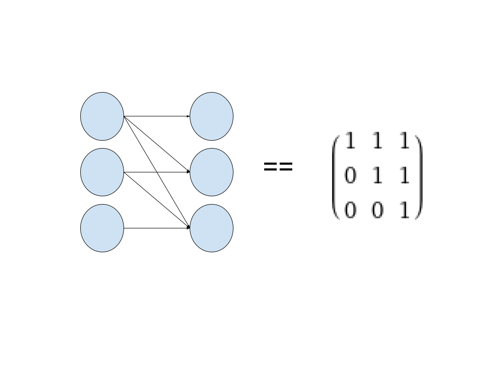
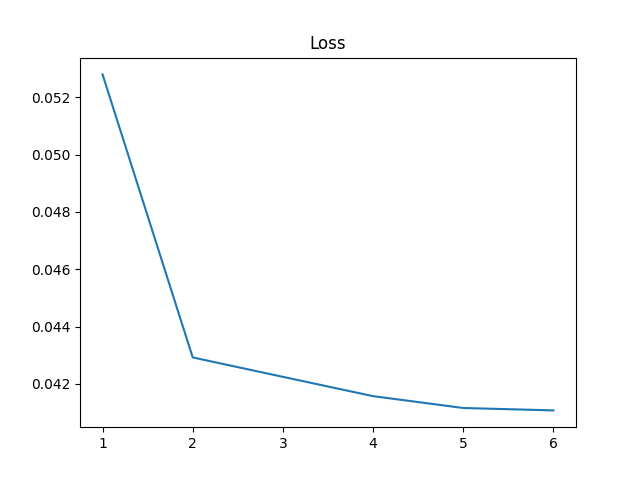

> This post is under development and is subject to changes 

In the [last post](https://yetools.net/4_ml_cvnn/cvnn/), we generated a melody using a multilayer perceptron (MLP). However, such networks assume no temporal dependency between the notes. Hence, the result was really bad. In this post we will change the model architecture to a Long Short Term Memory model (LSTM). Such a model is part of a broader set of models called Recurrent Neural Networks (RNN). These models use sequential data as inputs and are therefore a good fit for melody generation.

## LSTM

The naive way of making predictions with a MLP on sequential data was to use the last N timesteps as input to the first layer and train it to predict the data at the next timestep. If the data points are not numeric, as in the case with language, we have to find a way to represent the data numerically. In the example below we use the word’s index in a  wordlist as its numeric representation.

```
[“The”, “students”, “opened”] -> [10, 11112, 274]
```

However, in a MLP all inputs are treated equally and the model has no inductive bias about the fact that the inputs are sequential. To model the time dependency in sequential data, an idea could be to accumulate the previous data points as input.

```
[“The”, “students”, “opened”] -> [10, 11112, 274] -> [10, 10+11112, 10+11112+274]

```

This could be done with a simple preprocessing algorithm. Note however, such an algorithm would be equivalent to adding another dense layer to a MLP and assigning the weights to an upper triangular matrix with elements equal to 1.



This matrix could of course be learned from data instead. A MLP can therefore model sequential data in theory. However, this is very hard to achieve in practice and since we do know about the sequential nature of the data, we could save a lot of compute by introducing this inductive bias. This is what RNNs try to do. The only difference is that they also multiply the accumulated data points with a weight. This result is called the hidden state.

```
[“The”, “students”, “opened”] -> [10, 11112, 274] -> [w*10, w(w*10+11112), w(w(w*10+11112)+274)]
```

The hidden state at each timestep should now encode information about the sequence up to that point. It then can be used in different ways depending on the task. In language modeling, words are often represented by [embedding vectors](https://en.wikipedia.org/wiki/Word_embedding). The last element of the hidden state is therefore a vector which should hold the information of the sentence. This vector could therefore be used as the input to a MLP to predict the next word. An overview of language modeling with MLP vs RNN can be seen below.


[source](https://web.stanford.edu/class/cs224n/readings/cs224n-2019-notes05-LM_RNN.pdf)

One problem with RNNs comes from the vanishing/exploding gradient problem. In our example above we saw that the first input, 10, was multiplied by the weight 3 times. If we set the weight less than 1, this number will be tiny when we increase the sequence length. Likewise, if we set the weight greater than one the number will be huge. This number will appear in the equations for [backpropagation](https://en.wikipedia.org/wiki/Backpropagation) and will therefore lead to too small/big steps during optimization.


[source](https://www.deeplearning.ai/)

LSTMs have been proposed as a solution to this problem. In addition to passing on its hidden state, it also passes a cell vector c_t. The cell vector goes through a series of functions with learnable parameters to decide what information to keep and what to forget. With this technique, information can be propagated much longer before the gradients vanish/explode. An overview of the differences can be seen below.


[source](https://slideplayer.com/slide/12337673/)

The introduction of LSTMs improved the field of NLP, and the recent introduction of Transformers (which we will cover in the future) has enabled yet another leap. These techniques can hopefully carry over to music generation.
## Implementation
We will now use an LSTM to generate melodies. In language modeling we used word embeddings as input. Here, we instead use the vector representation of notes described in the [first post](https://yetools.net/3_ml_data/data/) of this series. However, we will make one improvement. We will normalize the input so that the range of possible values for the pitch and duration are the same. This makes optimization easier, as described in the image below.


[Source](https://stats.stackexchange.com/questions/322822/how-normalizing-helps-to-increase-the-speed-of-the-learning)

`encode_norm()` encodes the pitch and duration, before training, so that they both are between -1 and 1. `decode_norm()` decodes them back, after inference, to 0-128 and 0-16 respectively.

```
def encode_norm(note):
    return [(note[0]-64)/64, (note[1]-8)/8]

def decode_norm(note):
    return [round((note[0]*64)+64), round((note[1]*8)+8)]

```

As in the [previous post](https://yetools.net/4_ml_cvnn/cvnn/), we used pytorch to define our model class. Pytorch has a pre implemented LSTM which we use. To get meaningful results from the LSTM’s hidden states we add a linear layer to output the prediction. Note that `forward()` now also takes in the previous state as a parameter.

```
class LstmModel(nn.Module):
    def __init__(self, input_dim, hidden_dim=20, num_layers=1):
        super(LstmModel, self).__init__()
        self.input_dim = input_dim
        self.hidden_dim = hidden_dim
        self.num_layers = num_layers
        self.lstm = nn.LSTM(
                input_size=input_dim,
                hidden_size=self.hidden_dim,
                num_layers=self.num_layers)
        self.linear = nn.Linear(self.hidden_dim, input_dim)

    def forward(self, x, prev_state):
        output, state = self.lstm(x, prev_state)
        pred = self.linear(output)
        return pred, state
```

The training loop is almost identical to the [last post](https://yetools.net/4_ml_cvnn/cvnn/), except that we need to initialize the hidden state and the cell state to pass to `forward()`.

```
h_t = torch.zeros(model.num_layers, dataset.seq_len, model.hidden_dim).to(device)
c_t = torch.zeros(model.num_layers, dataset.seq_len, model.hidden_dim).to(device)
```


The loss graph seems promising, it decreases just as we want it to. However, the note generation paints a duller picture. It seems like our model has yet again learned to output the ‘average’ note.


`audio: ./lstm_output.mp4`

This time we cannot complain about the model architecture. People have successfully trained LSTMs to generate much better melodies than this. One potential issue could be our data representation. While the format makes intuitive sense, at least to me, we have not made a proper analysis. At first I thought that the main issue was that the model has been trained with too few parameters and not enough data. I used 1 lstm layer of size 20 and trained on 500 songs, in contrast [Performance RNN](https://magenta.tensorflow.org/performance-rnn) by Magenta uses 3 layers of size 512 and trains on 1400 songs with additional augmentation to obtain many more data points. However, I obtain the same results even with more parameters.

> To be continued. 

### Learning resources:
https://www.youtube.com/playlist?list=PL-wATfeyAMNr0KMutwtbeDCmpwvtul-Xz
https://www.kdnuggets.com/2020/07/pytorch-lstm-text-generation-tutorial.html
https://www.analyticsvidhya.com/blog/2021/07/understanding-rnn-step-by-step-with-pytorch/

