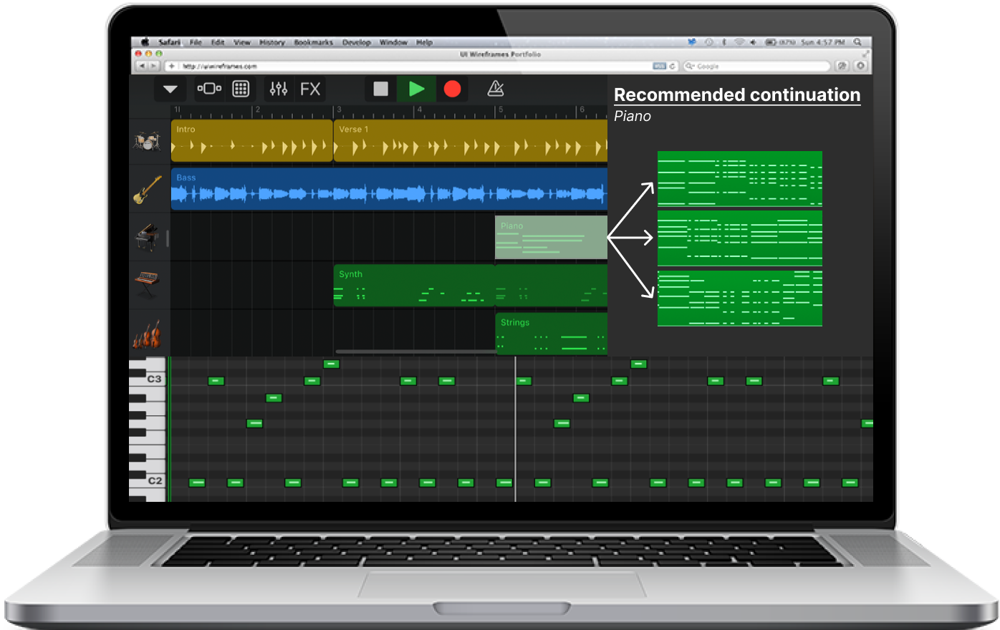

## Problem
The world of music production is changing. New music is no longer written on a piece of paper, imitating what is played on a guitar or a piano, but rather created in an idea-to-execution way in a Digital Audio Workstation (DAW). With the computer being the new piano, nearly 5 billion people have access to this potential hub of creativity, potentially unlocking the songwriting scene to people all over the world. However, this new way of creating music has inherited one of the biggest flaws of the traditional way: the technical difficulty. Playing an instrument is notoriously difficult, and unfortunately this has carried over to music writing in a DAW (this is obvious to anyone who has tried to navigate programs like Logic for the first time). Notably though, this difficulty is not per necessity but per design. While professional programs might need intricate designs to allow for full expressional freedom, there is an elitism built into many programs, which refuse to target an audience to which music production might be a completely new endeavor. On the other side of the spectrum are infantilizing dumbed-down point-and-click music generators. This leaves a void for people who might have a genuine interest in music creation but not the theoretical knowledge or the technical prowess to execute it in programs like Sibelius or Logic. A easy-to-use DAW with an AI-based recommendation-system to aid newcomers to the songwriting scene in getting started could fill this void and serve as a way to unlock the tallent reserve that have been locked in by the technical difficulty of traditional instruments.

## Product
At the core of our product will be an AI music generator. In its essence, machine learning systems are just function approximators. Here we want to build a system that approximates the world’s musical knowledge to allow people without an education in music to express their creativity. The field of NLP moved fast in the last couple of years, with chatGPT now having a deep understanding of natural language. There is no fundamental reason why the same algorithms can’t be used to build systems that have a deep understanding of music. We therefore propose to train a decoder-only transformer system on symbolic music data. This would result in a “Github-Copilot for music”, an auto completion tool that suggests the most statistically probable next note or chord, given your previous composition. This tool will then be incorporated into a simple DAW. The user can choose the length of the suggested sequence and draw inspiration from it, or use it as is. The target audience is not music professionals, we therefore don’t expect the user to provide input with an external MIDI-keyboard. Instead, we envision a workflow where the suggested sequence will be accepted and then modified by dragging around individual notes. The DAW will be available in a web interface and will not have a jungle of fancy features.

## Competition
Today,  DAWs have a market size of USD 2.51 billion, with a projected size of USD 4.74 billion in 2030. This is mainly made up by the complicated professional DAWs. There are also extremely simple-to-use interfaces with AI-engines that allow you to generate music with inputs such as tempo,  “density”, style etc. An example of this is Boomy. While this type of product has the merit of simplifying and thereby democratizing the creation process, they have a very obvious problem.  This simplification is made at the expense of the range of creativity. The user has very little impact over the actual output, and if you have a concrete idea or melody in mind, this is impossible to recreate in a program such as Boomy. A combination of a simplified DAW with a music generation engine would combine the best of two worlds, leaving the user with the creative space of a traditional DAW, but the simplicity and creativity-support of a program such as Boomy.

